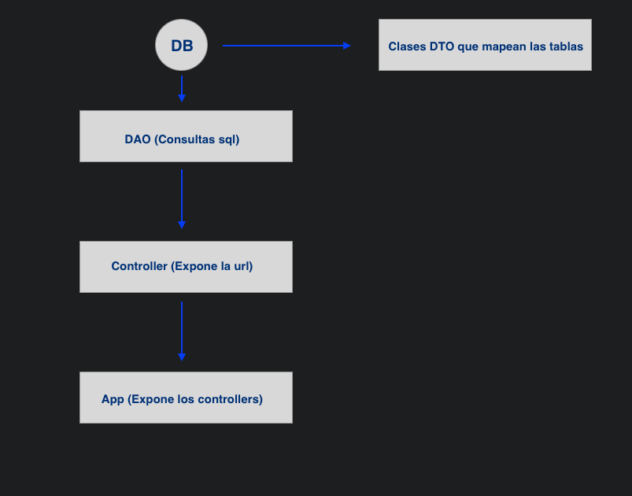
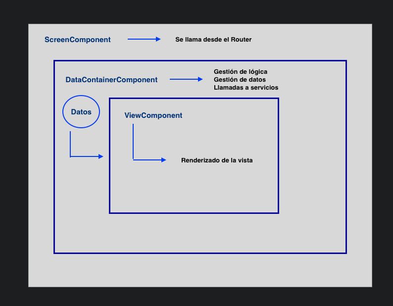

# 2020-10-btc-agile-sw-online-project

<p align="center">
    	
</p>

## Workflow
```
Forkea el proyecto y trabaja en tu rama.
Commitea de vez en cuando las 'features' que vayas desarrollando.
Una vez lo creas necesario, haz un 'pull request' a la rama Master.
Avísanos por el slack del curso.
```

## Información
```
Nombre del proyecto : Dark Souls Forum 
Descripción: Foro simple dónde se pueden añadir hilos y comentar en ellos.
Temática Dark Souls.
Alumno: Elías Martínez Sánchez
```

## Instalación
El proyecto está dockerizado por lo tanto no necesario descargar dependencias.
Para correr el contener, situado en la raíz del proyecto ejecuta:

``docker-compose up``

Una vez los contenedores estén corriendo usa esta url para acceder a la aplicación:
http://localhost:3000/threads

| Contenedor | URL |
| :-------: | :------: |
| Frontend (React) | localhost:3000 |
| Backend (Node express) | localhost:8080 | 
| Mysql | localhost:3306 | 
| Phpmyadmin | localhost:8082 | 


## Versiones
| Alias | Version |
| :-------: | :------: |
| Jest | 26.0 |
| Cypress.io | 6.4 | 
| React | 17.0.1 | 
| Express | 4.17.1 | 


## Línea de comandos

Ejecución de test: 

**Es necesario tener el contenedor de docker corriendo para ejecutar tantos los
test unitarios como los test de integración.**

**Para ejecutar cualquier tipo de test también es necesario instalar las dependencias**

Antes de ejecutar los test de frontend: ```./app yarn install```

Antes de ejecutar los test de backend: ```./api yarn install```

Test unitarios backend: situado en /api ejecuta:
``yarn test``

Test unitarios frontend: situado en /api ejecuta:
``yarn test``

Test integración frontend: situado en /app ejecuta:
``npx cypress run``


## Principios SOLID
| Principio | Fichero 
| :-------: | :------: |
| SRP | App.ts  |
| SRP | AppControllerStarter.ts  |
| LSP | AppControllerStarter.ts  |
| SRP | AppMiddlewaresStarter.ts  |
| SRP | AppRunner.ts  |
| OCP | BaseController.ts  |
| OCP | BaseDAO.ts  |
| OCP | Page.ts  |
| ISP | StyledProps.ts  |
| SRP | UseAddComment.ts  |
| SRP | UseDeleteComment.ts  |
| SRP | UseFetchComments.ts  |
| SRP | UseAddThread.ts  |
| SRP | UseDeleteThread.ts  |
| SRP | UseFetchThreads.ts  |
| SRP | RouteGenerator.ts  |
| SRP | DateFormatter.ts  |
| SRP | ConnectionManager.ts  |
| SRP | CommentMapper.ts  |
| SRP | ThreadMapper.ts  |

## Patrones
| Patrón | Fichero | Método
| :-------: | :------: |:------: |
| Singleton | ConnectionManager.ts  | getConnetion() |
| PageObject | ThreadListPage.ts
| PageObject | CommentListPage.ts
| DTO | CommentDTO.ts
| DTO | ThreadDTO.ts
| DAO | CommentDAO.ts
| DAO | ThreadDAO.ts


## Docker
| Dependencias 
| :-------: | 
| Docker compose | 

## Notas
```
Url del Video
```

### Arquitectura backend


### Arquitectura frontend

